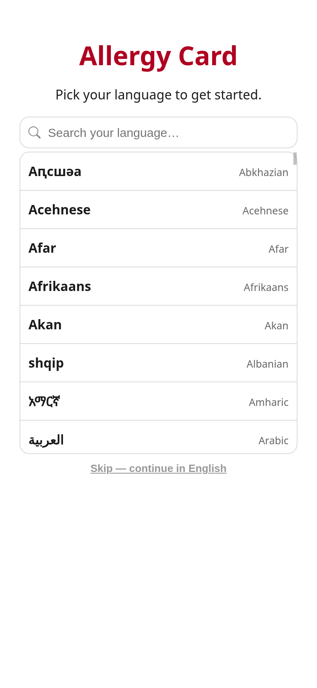
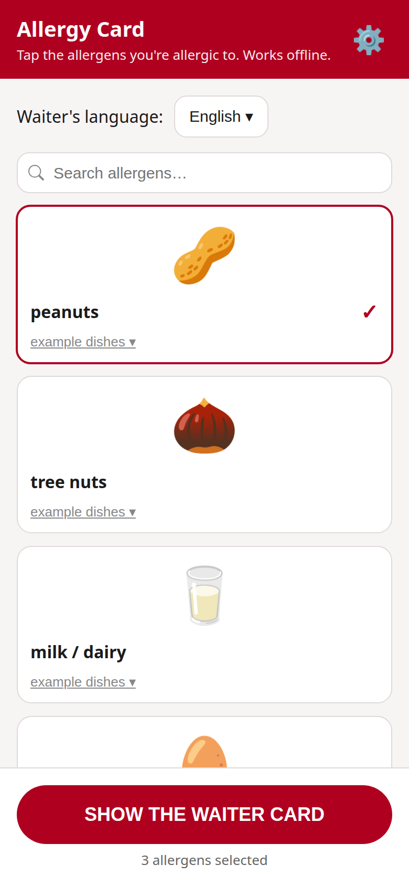
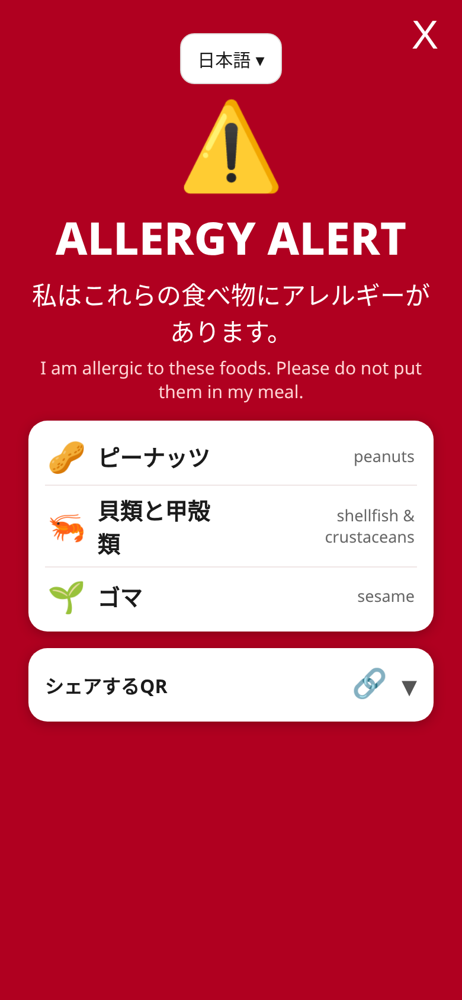

# Allergy Card

A small app for travellers with food allergies.

Pick your allergens, pick a language, and hand the waiter a big, unmistakable red card
listing what you can't eat — in *their* language.

**Live web version:** https://payne911.github.io/allergy-card/ — the same app in your
browser, no download needed.

## One codebase

Everything lives in [`docs/`](docs/index.html): one single-page app in plain HTML/JS —
allergen photos, languages, severity levels, shareable URLs and the QR code.

- The **website** is those files served as-is (GitHub Pages from `main:/docs`).
- The **Android app** is a bare WebView shell (`app/…/MainActivity.kt`, ~50 lines)
  that bundles the exact same files offline. Gradle copies `docs/` into the APK
  before every build (`syncWebAssets` in `app/build.gradle.kts`).

Change something once in `docs/`, and both the site and the app get it.

## Screenshots

| First-launch walkthrough | Picking allergens | The waiter card |
| --- | --- | --- |
|  |  |  |

## Features

- 16 major allergens (peanuts, tree nuts, dairy, egg, wheat/gluten, soy, peas, chickpeas,
  lentils, fish, shellfish, sesame, mustard, celery, sulfites, lupin), each depicted with
  real photographs instead of emojis — swipe an allergen card to see more pictures.
- A severity level per allergen — "makes me ill", "can't eat it", or "deadly" — shown
  prominently on the card, with an extra warning banner when anything is marked deadly.
- A shareable card link and QR code: the whole profile (allergens, levels, language) is
  encoded in the URL, so the waiter can scan the QR and carry the card to the kitchen
  on their own phone.
- Example dishes that commonly contain each allergen, plus hidden-source notes
  (fish sauce in Southeast Asian cooking, wheat in soy sauce, shrimp paste in curries…).
- A full-screen, high-contrast "show the waiter" card.
- A first-launch walkthrough showing new users the three things to do:
  pick allergens, choose a language, show the red card.

## Fully offline, fully private

- **No internet needed at the table.** The Android app ships with everything on board
  and the web version caches itself on first load (service worker), so both work
  with airplane mode on.
- **No data leaves your device.** Your selected allergens and language are stored
  locally only (`localStorage` — the Android shell uses the same storage as
  the browser build). There is no account, no server, and nothing to "delete"
  anywhere else.

## Languages

English, French, Spanish, Italian, German, Portuguese, Japanese, Chinese,
Korean, Thai, Vietnamese, Arabic.

## Build (Android)

Open in Android Studio, or:

```bash
gradle assembleDebug
```

No design decision to make about "keeping the app in sync": the Gradle
`syncWebAssets` task copies `docs/` into `app/src/main/assets/` on every build,
so the APK always ships the same card the website serves. The shell itself
needs nothing beyond the Android SDK — one WebView, zero dependencies.

A GitHub Actions workflow that builds `app-debug.apk` is ready in
`android-workflow.yml.disabled`; move it into `.github/workflows/` to enable CI
(requires a token with the `workflow` scope).

## Disclaimer

This is a personal project, nothing more. It is provided as-is, with no guarantee
of any kind. Translations and example dishes are best-effort reference material,
not medical advice. I am not responsible for any issues that come from using this
app — always double-check with the restaurant and carry your medication.

## Web preview (this repo)

The preview site lives in [`docs/`](docs/index.html) — all allergens, languages,
example dishes, severity levels, shareable URLs with a QR code, and the red waiter
card, with choices persisted in `localStorage` and a service worker
(`docs/sw.js`) for offline use. Photos are bundled under `docs/images/`
(see [CREDITS](docs/images/CREDITS.md)); QR codes are generated on-device by the
bundled open-source [qrcode-generator](https://github.com/kazuhikoarase/qrcode-generator)
library (`docs/qr.js`). The site auto-deploys from `main:/docs` on every push.
